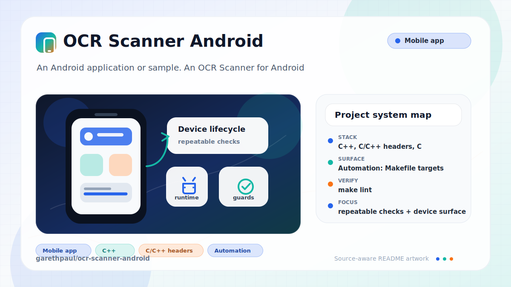

# ocr-scanner-android

<!-- README-OVERVIEW-IMAGE -->


## Overview

`garethpaul/ocr-scanner-android` is an Android application or sample. An OCR Scanner for Android

This README is based on the checked-in source, manifests, scripts, and repository metadata on the `master` branch. The project language mix found during review was: C++ (10), C/C++ headers (5), C (4), Java (3).

## Repository Contents

- `CHANGES.md` - baseline change log
- `Makefile` - local static verification entry point
- `build.gradle` - Android or Gradle build configuration
- `app` - source or example code
- `gradle` - source or example code
- `gradlew` - Android or Gradle build configuration
- `jni` - source or example code
- `scripts/check-baseline.py` - static baseline checks
- `SECURITY.md` - security reporting and disclosure guidance
- `VISION.md` - project direction and maintenance guardrails

Additional scan context:

- Source directories: app, gradle, jni
- Dependency and build manifests: build.gradle, gradlew
- Entry points or build surfaces: Gradle build files
- Test-looking files: no obvious test files detected

## Getting Started

### Prerequisites

- Git
- Android Studio or a compatible Android SDK
- Gradle or the checked-in Gradle wrapper when present

### Setup

```bash
git clone https://github.com/garethpaul/ocr-scanner-android.git
cd ocr-scanner-android
make lint
make test
make build
make check
```

The setup commands above are derived from repository files. Legacy mobile, Python, or JavaScript samples may require older SDKs or package versions than a modern workstation uses by default.

## Running or Using the Project

- Use Android Studio to open the project or run `./gradlew assembleDebug` when the Android SDK is configured.
- Camera captures are written to timestamped files under the legacy
  external-storage `TessOCR` directory so a new capture does not overwrite the
  previous image.
- Activity lifecycle and photo result paths should not print OCR details to
  stdout.
- Image URI decode failures use tagged Android logging instead of dumping stack
  traces.
- Shared image intents forward their `EXTRA_STREAM` URI into the result screen
  instead of launching an empty OCR flow.
- The manifest advertises an image-only share target so text shares are not
  routed into an OCR-only flow.
- Shared image stream guards stop OCR before processing when the incoming image
  stream cannot be opened or decoded.
- The image open failure message keeps unreadable shared image URIs visible in
  the result screen without exposing raw URI details.
- Denied shared image access is handled like a missing image instead of
  crashing, and URI open/close logs omit exception payloads.
- OCR traineddata streams are closed through a shared cleanup helper after
  asset copies, including failed copies.

## Testing and Verification

- `make lint`
- `make test`
- `make build`
- `make check`
- `python3 scripts/check-baseline.py`
- `./gradlew test` or Android Studio's test runner when the SDK is configured
- Pinned hosted Linux validation runs the SDK-free baseline on Python 3.12.
- The baseline verifies the checked-in Gradle wrapper JAR against SHA-256
  `e2b82129ab64751fd40437007bd2f7f2afb3c6e41a9198e628650b22d5824a14`.

When the required SDK or runtime is unavailable, use static checks and source review first, then verify on a machine that has the matching platform toolchain.

## Configuration and Secrets

- No required secret or credential file was identified in the repository scan. If you add integrations later, keep secrets out of git.

## Security and Privacy Notes

- The app processes camera images and OCR text. Android `allowBackup` is
  disabled and Tesseract debug logging should remain off.
- The legacy code still uses external storage for image and Tesseract data; do
  not commit captured images, OCR output, or generated device data.
- Collision-resistant timestamped capture files are still private user data and
  should remain local to the device or test fixture environment.
- Keep stdout clear of OCR lifecycle and photo result details.
- Avoid stack trace dumps around private image URI handling.
- Shared image intent handling should require an image MIME type and a stream
  URI before OCR processing starts.
- Keep the share intent filter image-only so Android does not offer the OCR
  activity for text/plain content it cannot process.
- Shared image stream guards should keep null input streams and failed decodes
  from reaching OCR.
- The image open failure message should remain user-facing when a shared image
  URI cannot be opened.
- Keep denied shared image access user-safe and keep provider, path, and
  exception details out of URI failure logs.
- OCR traineddata streams should be closed after asset-copy attempts, and copy
  failures should use generic tagged logging.
- Generated NDK outputs under `obj/` are intentionally ignored and should not
  be committed; keep only source, packaged OCR assets, and documented native
  library drops in git.
- Keep the repository free of orphaned gitlinks; native OCR source is vendored
  under `jni/`, and no active submodule contract is declared.
- Treat the Gradle wrapper JAR as executable build tooling. Review provenance
  before updating its pinned checksum.
- Review changes touching authentication or token handling; examples from the scan include jni/com_googlecode_tesseract_android/glibc/glob.c.
- Review changes touching network requests, sockets, or service endpoints; examples from the scan include app/src/main/AndroidManifest.xml, app/src/main/java/com/garethpaul/scanr/MainActivity.java, app/src/main/res/layout/activity_main.xml, app/src/main/res/layout/activity_result.xml, and 6 more.
- Review changes touching mobile permissions or privacy-sensitive device data; examples from the scan include app/src/main/AndroidManifest.xml, app/src/main/java/com/garethpaul/scanr/MainActivity.java, gradlew, jni/com_googlecode_leptonica_android/box.cpp, and 6 more.
- Review changes touching file, media, JSON, XML, CSV, OCR, or data parsing; examples from the scan include app/src/main/AndroidManifest.xml, app/src/main/java/com/garethpaul/scanr/MainActivity.java, app/src/main/java/com/garethpaul/scanr/ResultActivity.java, app/src/main/res/layout/activity_result.xml, and 6 more.

## Maintenance Notes

- This looks like a legacy Android project or sample. Expect Android SDK, Gradle, and support-library versions to matter.
- Run `make lint`, `make test`, `make build`, and `make check` before changing
  manifest permissions, OCR setup, image decode paths, or Gradle metadata.
- See `docs/plans/2026-06-09-make-gate-aliases.md` for the local verification
  gate aliases.
- See `docs/plans/2026-06-10-image-open-failure-message.md` for the image open
  failure message guardrail.
- See `docs/plans/2026-06-10-unique-camera-captures.md` for the camera filename
  collision guardrail.
- Keep generated NDK intermediates, APKs, local SDK config, and signing
  material out of the repository.
- See `SECURITY.md` for vulnerability reporting and safe research guidance.
- See `VISION.md` for project direction and contribution guardrails.

## Contributing

Keep changes small and tied to the project that is already present in this repository. For code changes, document the toolchain used, avoid committing generated dependency directories or local configuration, and update this README when setup or verification steps change.
